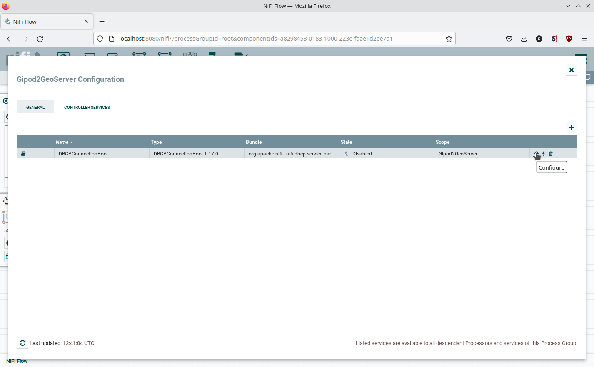

# Demo of GIPOD data in GeoServer

## Setup
* Start the docker stack
```
docker-composer up
```
This will start Apache NiFi, PostreSQL and GeoServer.
Next, load the demo data pipeline in Apache NiFi

* Go to the [NiFi web interface](http://localhost:8080/nifi/)

* Load the process group from the file '[Gipod2GeoServer.json](Gipod2GeoServer.json)'.
 
 

* Configure the process group by clicking the cogwheel under the 'Operate' pane.
 

* Now configure the database pool settings.
 

* Select the properties tab, and click the 'password' property. Make sure this matches the PostgreSQL password set in [docker-compose.yml](docker-compose.yml).
 

* Enable the database pool service.
 
 
* Enter the process group by either dubble clicking, or right-click + 'Enter group'
 

* Click start in the Operate pane, to start all processors.
 

* The database is now being populated with Gipod hindrances. This process can take quite some time.

## GeoServer endpoint

The endpoint is available at http://localhost:8002/geoserver/gipod-ldes/wms

## Power BI dashboard
Open Power BI file and sync datasets with PostGIS db tables


